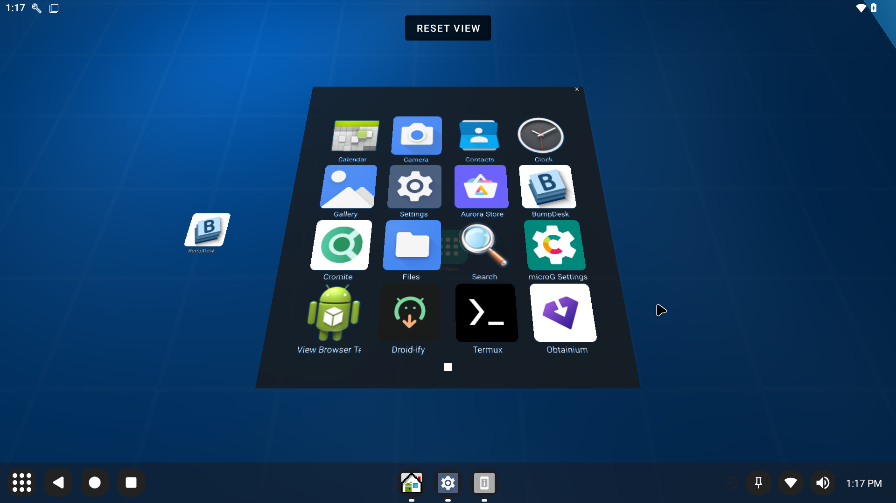

# BumpDesk - 3D Android Workspace

BumpDesk is an experimental 3D launcher for Android that reimagines the traditional home screen as a physical workspace. Inspired by the classic "BumpTop" desktop metaphor, it treats applications, widgets, and notes as physical objects that can be moved, stacked, pinned to walls, and interacted with in a natural way.


## 🌟 Key Features

- **Physics-Based Workspace**: Objects collide, bounce, and have "weight". Move items naturally around the room.
- **Surface Organization**: Use the floor for active work and walls for pinning important apps or widgets.
- **Smart Piles**: Gather items into piles by "lassoing" them. Piles can be fanned out for quick scanning or expanded into an organized grid.
- **Immersive Widgets**: Android widgets are rendered as 3D panels. Interact with them directly in the 3D scene.
- **Recent Tasks Carousel**: A dedicated 3D view on the back wall showing live snapshots of your recently used applications.
- **Dynamic Themes & Procedural Shaders**: Fully customizable workspace appearance. Themes like **BumpDesk Animated** feature real-time procedural caustics and underwater effects.
- **SVG Vector Support**: High-fidelity rendering across all surface textures and icons using sharp vector graphics.
- **Contextual UI**: Intuitive radial menus provide quick access to advanced launch modes (Freeform, Pinned, Fullscreen) and item properties.

## 📊 Current Project State

BumpDesk is in an **Advanced Beta** state.
- **Stability**: High. Recent infrastructure refactors (VBOs, LRU Texture Caching, and Synchronized Concurrency) have significantly improved frame rates and memory reliability.
- **Performance**: Optimized for O(n log n) physics scaling and batched rendering.
- **Persistence**: Desktop layouts, widgets, and theme preferences are fully saved via Room DB.



## 🚀 Getting Started

### Run Instructions
1.  Open the project in **Android Studio Koala (or newer)**.
2.  Connect an Android device or emulator (Android 12+ recommended).
3.  Run the `:app:assembleDebug` task.
4.  Launch the app. On first run, follow the **Onboarding Wizard** to grant permissions and optionally set BumpDesk as your default home app.

### Prerequisites
- Android device running Android 12 (API 31) or higher.
- Support for OpenGL ES 2.0.

### Installation & Permissions
For the best experience, several system-level settings should be configured via ADB:

1. **Enable Usage Statistics** (Required for Recent Apps):
   ```bash
   adb shell appops set com.bass.bumpdesk GET_USAGE_STATS allow
   ```

2. **Enable Freeform Windowing** (For "Open As > Freeform"):
   ```bash
   adb shell settings put global enable_freeform_support 1
   adb shell settings put global force_resizable_activities 1
   adb reboot
   ```

3. **Grant Snapshot Permissions** (Optional - Requires Root/AOSP Privileges):
   To see live app snapshots in the Recents carousel instead of icons:
   ```bash
   adb shell pm grant com.bass.bumpdesk android.permission.REAL_GET_TASKS
   ```

## 🛠 Architecture

BumpDesk is built using:
- **OpenGL ES 2.0**: For high-performance 3D rendering using Vertex Buffer Objects (VBOs).
- **Custom Physics Engine**: Optimized with Spatial Grid Partitioning for high item counts.
- **Modular Shader Engine**: Supports theme-local GLSL injection for custom procedural effects.
- **Kotlin & Coroutines**: For efficient thread-safe state management.
- **Room Persistence**: To save your desktop layout across reboots.

## 🤖 AI in Development

This project leverages a strict **AI Workflow & Reward System**:
- **Test-First**: Verification tests are created before major logic changes.
- **Build-After-Edit**: Automated builds verify every iteration to prevent regressions.
- **Lead Developer Agent**: The development is guided by an AI agent that maintains a detailed `dev_plans.md` and earning points for verified completions.

## 💎 Credits & Inspiration

- **BumpTop**: This project is a spiritual successor to the original [BumpTop](https://en.wikipedia.org/wiki/BumpTop) software.
- **BumpTop Open Source**: Significant inspiration and logic references were drawn from the [BumpTop Windows Source Code](https://github.com/bumptop/BumpTop).
- **Themes**: Default assets and theme logic are designed to be compatible with legacy BumpTop theme formats.

## 📜 License

This project is licensed under the Apache License 2.0 - see the [LICENSE](LICENSE) file for details.
